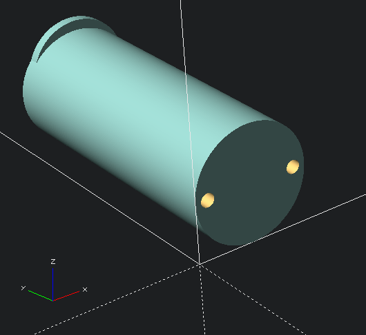

# Anycubic Mega S/X Filament Holder

I recently bought a roll of "wood" PLA filament from the company "WG Chemicals" for use with my Anycubic Mega X printer, only to realize the hole in the filament spool was too small to fit on the spool holder.  
  
This repo contains an OpenSCAD file for a smaller filament holder rod to replace the OEM one from Anycubic.  
There are screw holes to match the OEM screws and their placement, and a small lip at the far end to help keep the spool from sliding off.  
  
Dimensions: (L x W x H) 58mm x 23mm x 23mm
  
It looks like this:  
   
  
Enjoy!
